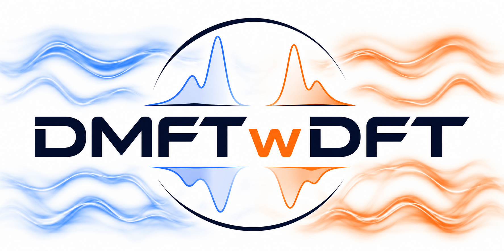
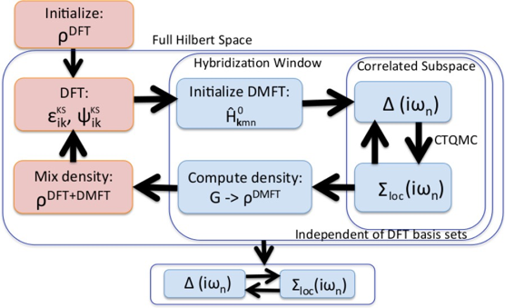

# DMFTwDFT3

DMFTwDFT is an open-source, user-friendly framework to calculate properties of strongly correlated materials (SCM) using DFT+DMFT (Dynamical Mean Field Theory) with a variety of different DFT codes. Currently supports VASP, Siesta and Quantum Espresso.



## Features <br />


## Workflow <br />



## Quick Install

Please refer to the documentation: https://dmftwdft.github.io/DMFTwDFT3

1\. Create a Python environment using a recommended `environment.yml` file.

- Linux: `mamba env create -f environment.yml`
- macOS: `mamba env create -f environment.macos.yml`

2\. Copy a build template to the repository root as `Makefile.in` and edit values as needed for your system.

- `config/Makefile.in.gnu`: GNU compilers on Linux-style systems.
- `config/Makefile.in.intel`: Intel oneAPI compilers.
- `config/Makefile.in.mac`: macOS Apple Silicon/Homebrew OpenMPI build using Homebrew compilers/MPI/OpenBLAS and conda-provided Python/GSL where configured.

3\. Run the setup script,

```bash
python setup.py
```

## Usage

Copy the DFT inputs (see [examples](https://github.com/dmftwdft/DMFTwDFT3/tree/master/examples)) along with an `input.toml` file to a working directory and run,

```shell
DMFT.py -dft <dft_code> -structurename <name_of_structure> -dmft
```

E.g., for SrVO3 with Siesta,

```shell
DMFT.py -dft siesta -structurename SrVO3 -dmft
```

Afterwards, for post-processing run,

```shell
postDMFT.py ac -siglistindx 4
postDMFT.py dos
postDMFT.py bands -plotplain
```

## Developers

Hyowon Park <br />
Aldo Romero <br />
Uthpala Herath <br />
Vijay Singh <br />
Benny Wah <br />
Xingyu Liao <br />

## Contributors

Kristjan Haule <br />
Chris Marianetti <br />

## How to cite

If you have used DMFTwDFT in your work, please cite:

[DMFTwDFT: An Open-Source Code Combining Dynamical Mean Field Theory with Various Density Functional Theory Packages. Singh, V., Herath, U., Wah, B., Liao, X., Romero, A. H., and Park, H. Computer Physics Communications, 261: 107778. April 2021.](https://www.sciencedirect.com/science/article/abs/pii/S001046552030388X)

BibTex:

    @article{SINGH2021107778,
    title = "DMFTwDFT: An open-source code combining Dynamical Mean Field Theory with various density functional theory packages",
    journal = "Computer Physics Communications",
    volume = "261",
    pages = "107778",
    year = "2021",
    issn = "0010-4655",
    doi = "https://doi.org/10.1016/j.cpc.2020.107778",
    url = "http://www.sciencedirect.com/science/article/pii/S001046552030388X",
    author = "Vijay Singh and Uthpala Herath and Benny Wah and Xingyu Liao and Aldo H. Romero and Hyowon Park",
    keywords = "DFT, DMFT, Strongly correlated materials, Python, Condensed matter physics, Many-body physics",
    }

## Mailing list

Please post your questions on our forum: https://groups.google.com/d/forum/dmftwdft

## Acknowledgements

We acknowledge the use of the following packages,

\- [Continuous time Quantum Monte Carlo (ctqmc)](http://hauleweb.rutgers.edu/tutorials/Tutorial0.html) through the eDMFT library.<br />

[1] Kristjan Haule, Phys. Rev. B 75, 155113 (2007). <br />
[2] Kristjan Haule, Turan Birol, Phys. Rev. Lett. 115, 256402 (2015).

\- [Wannier90](http://www.wannier.org/)<br>

[1] Wannier90 as a community code: new features and applications, G. Pizzi et al., J. Phys. Cond. Matt. 32, 165902 (2020)

## Changelog

v2.1 June 12, 2026 - Migrated inputs from INPUT.py to input.toml.<br />
v2.0 June 8, 2026 - Updated code to support modern compute architectures including Python3, Intel oneAPI LLVM compilers and MacOS.<br />
v1.2 Jan 13th, 2020 - Fixed bug with exponentially large numbers in UNI_mat.dat for SCF calculations. <br />
v1.1 May 11th, 2020 - Added support for Quantum Espresso through Aiida. <br />
v1.0 April 23, 2020 - Cleaned repository. Defaulted to Python 2.x version. <br />
v0.3 November 25, 2019 - Added DMFT.py and postDMFT.py scripts <br />
v0.2 July 10, 2019 - DMFTwDFT library version <br />
v0.1 July 31, 2018 - Initial release (Command line version)
